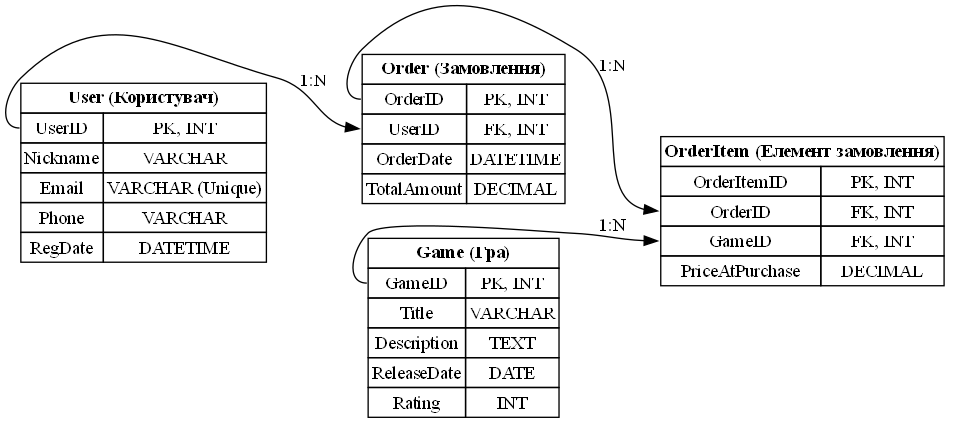

# Проектування БД (Лр №1)

## 🎓 Роботу виконали
**Группа:** ІО-45

**Студенти:**
Карпець М.А.
Унятицький А.Д.
Сизоненко А.О.

**Роботу перевірив:**
Русінов В.В.

---

*Київ, 2026*

## 📋 Огляд проєкту
**Тема** - збір вимог та розробка ER.
**Мета** - підготовка до наступних лабораторних робіт: реалізація моделі у вигляді таблиць PostgreSQL, написання SQL-запитів (OLTP/OLAP) та застосування нормалізації та міграцій.

---

## 🏗️ Хід роботи
У процесі виконання було проведено аналіз потреб користувача, створено концепцію БД та розроблено ER-діаграм.

### Призначення БД:
Створення бази даних для цифрового магазину ігор, що дозволяє користувачам реєструватися, переглядати каталог та здійснювати покупки.

### Дані, що зберігаються:
* Інформація про користувачів (логіни, контактні дані).
* Детальний опис ігор.
* Повна історія замовлень.

> **Бізнес правила:** Замовлення не можуть бути опрацьовані без прив’язки до існуючого користувача.

---

## 📊 Структура даних (ER)

### Сутності та їх атрибути
| Сутність | Атрибути |
| :--- | :--- |
| **Користувач** | `UserID (PK)`, `Нік`, `Пошта`, `Дата реєстрації`, `Номер телефону` |
| **Гра** | `GameID (PK)`, `Назва`, `Опис`, `Дата додавання`, `Віковий рейтинг` |
| **Замовлення** | `OrderID (PK)`, `UserID (FK)`, `Дата придбання`, `Сума замовлення` |
| **Елемент замовлення** | `OrderItemID (PK)`, `OrderID (FK)`, `GameID (FK)`, `Ціна на момент покупки` |

### Зв’язки між таблицями:
* **Користувач — Замовлення (1:N):** Один зареєстрований користувач може здійснювати необмежену кількість покупок протягом усього часу роботи з платформою. При цьому кожне окреме замовлення жорстко прив'язане лише до одного конкретного аккаунта користувача для забезпечення фінансової звітності та безпеки.
* **Замовлення — Елемент замовлення (1:N):** Одне замовлення (чек) може містити в собі кілька різних ігор. Сутність «Елемент замовлення» слугує для деталізації кожної позиції в кошику, дозволяючи зберігати окрему ціну для кожної гри на момент покупки.
* **Гра — Елемент замовлення (1:N):** Елемент замовлення (Один до багатьох): Кожна конкретна гра з каталогу може бути присутня у багатьох різних замовленнях різних користувачів. Це дозволяє системі відстежувати популярність окремих продуктів та їхні продажі.

---

## 🔐 Обмеження
Для забезпечення коректної роботи системи впроваджено наступні правила:
1.  **Унікальність:** Поле `Email` є унікальним; реєстрація двох людей на одну пошту неможлива.
2.  **Цілісність:** Неможливо створити «Елемент замовлення», якщо в базі не існує відповідної гри або самого замовлення (забезпечується зовнішніми ключами FK).
3.  **Бізнес-логіка:** Користувач не може оформити порожнє замовлення без жодного доданого товару.

---

## Висновок
В ході виконня лабораторної роботи ми навчилися проводити аналіз потреб користувача. Також ми навчилися створювати концепцію БД, і на її основі створювати ER діаграми. Також був створений список сутностей та атрибутів
