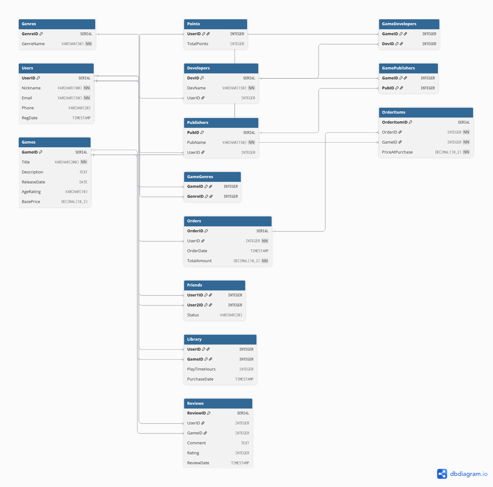
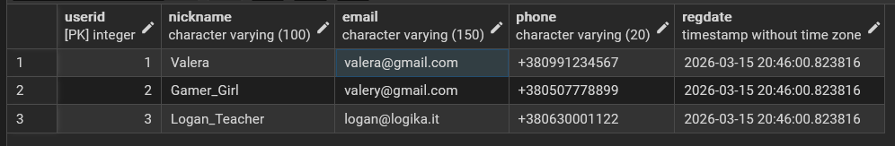
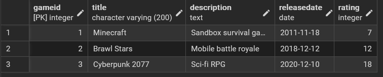
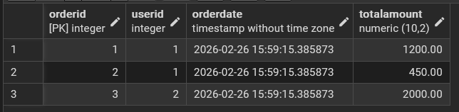
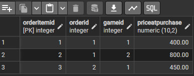

# Перетворення ER-діаграми на схему PostgreSQL (Лр №2)


<div align="right">

## 🎓 Роботу виконали
**Группа:** ІО-45

**Студенти:**
Карпець М.А.
Унятицький А.Д.
Сизоненко А.О.

**Роботу перевірив:**
Русінов В.В.

</div>

---
<center>

*Київ, 2026*

</center>

## 📋 Огляд проєкту
**Тема** - перетворення ER-діаграми на схему PostgreSQL.
**Мета** -  Написати SQL DDL-інструкції для створення кожної таблиці ERD в PostgreSQL.

## 🏗️ Хід роботи
Була використана ER діаграма з минулої лабораторної роботи


#### Роздруківка коду для створення самої діаграми:
```Sql
-- 1. Таблиця Користувачів
CREATE TABLE Users (
    UserID SERIAL PRIMARY KEY,
    Nickname VARCHAR(100) NOT NULL,
    Email VARCHAR(150) NOT NULL UNIQUE,
    Phone VARCHAR(20),
    RegDate TIMESTAMP DEFAULT CURRENT_TIMESTAMP
);

-- 2. Таблиця Ігор
CREATE TABLE Games (
    GameID SERIAL PRIMARY KEY,
    Title VARCHAR(200) NOT NULL,
    Description TEXT,
    ReleaseDate DATE,
    Rating INTEGER
);

-- 3. Таблиця Замовлень
CREATE TABLE Orders (
    OrderID SERIAL PRIMARY KEY,
    UserID INTEGER NOT NULL REFERENCES Users(UserID),
    OrderDate TIMESTAMP DEFAULT CURRENT_TIMESTAMP,
    TotalAmount DECIMAL(10, 2) NOT NULL CHECK (TotalAmount >= 0)
);

-- 4. Таблиця Елементів замовлення
CREATE TABLE OrderItems (
    OrderItemID SERIAL PRIMARY KEY,
    OrderID INTEGER NOT NULL REFERENCES Orders(OrderID),
    GameID INTEGER NOT NULL REFERENCES Games(GameID),
    PriceAtPurchase DECIMAL(10, 2) NOT NULL CHECK (PriceAtPurchase > 0)
);
```

#### Далі були введені дані для відповідної таблиці:
```Sql
-- Дані для Users
INSERT INTO Users (Nickname, Email, Phone) VALUES
('Gamer_Boy', 'gamer.boy@example.com', '+380990001122'),
('Shadow_Hack', 'cyber_pro@logika.ua', '+380671112233'),
('Gamer_Girl', 'alice_games@ukr.net', '+380503334455');

-- Дані для Games
INSERT INTO Games (Title, Description, ReleaseDate, Rating) VALUES
('Minecraft', 'Sandbox survival game', '2011-11-18', 7),
('Brawl Stars', 'Mobile battle royale', '2018-12-12', 12),
('Cyberpunk 2077', 'Sci-fi RPG', '2020-12-10', 18);

-- Дані для Orders (Користувач 1 зробив два замовлення)
INSERT INTO Orders (UserID, TotalAmount) VALUES
(1, 1200.00),
(1, 450.00),
(2, 2000.00);

-- Дані для OrderItems
INSERT INTO OrderItems (OrderID, GameID, PriceAtPurchase) VALUES
(1, 1, 400.00),
(1, 2, 800.00),
(2, 1, 450.00);
```

#### Результат роботи в PostgreSQL





## Висновок
При виконанні цієї роботи ми навчилися перетворювати ER діаграми у повноцінні бази даних. При роботі з ними був встановлений та на базовому рівні опанований Docker. А також ми ознайомилися з основами SQL.
