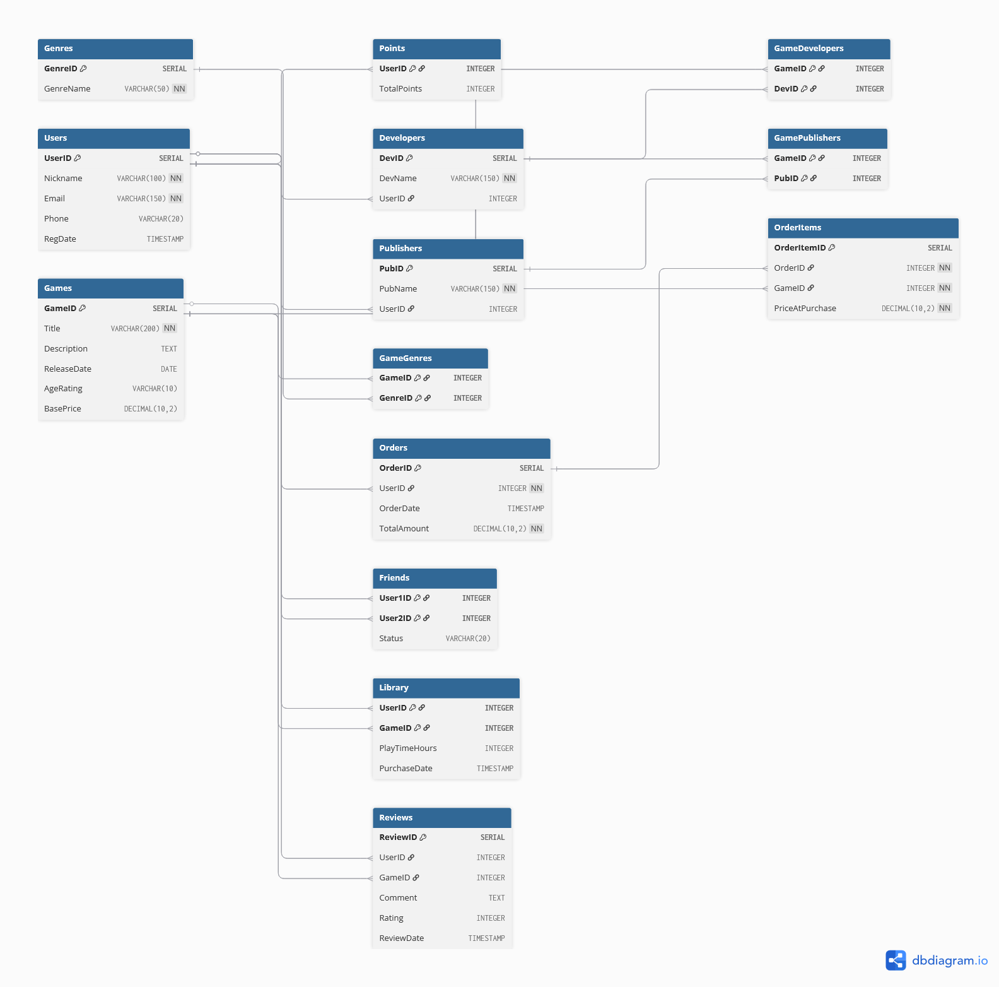
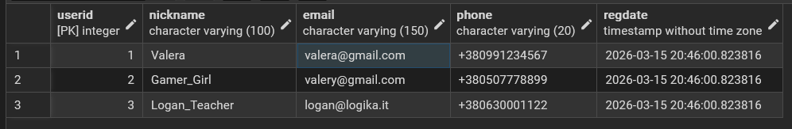
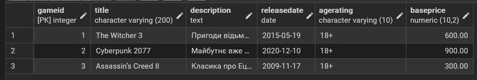
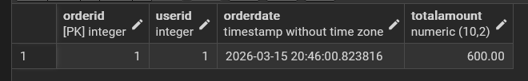
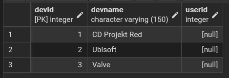
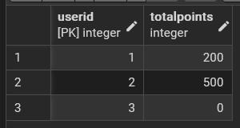
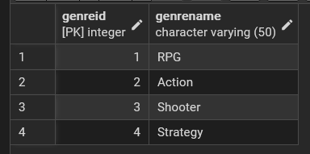
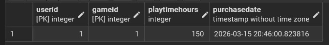
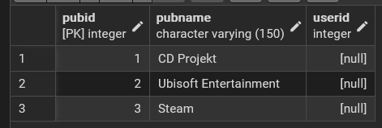
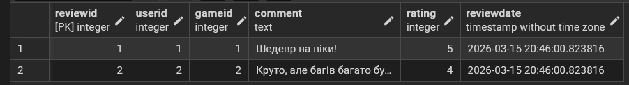

# Перетворення ER-діаграми на схему PostgreSQL (Лр №2)


<div align="right">

## 🎓 Роботу виконали
**Группа:** ІО-45

**Студенти:**
Карпець М.А.
Унятицький А.Д.
Сизоненко А.О.

**Роботу перевірив:**
Русінов В.В.

</div>

---
<center>

*Київ, 2026*

</center>

## 📋 Огляд проєкту
**Тема** - перетворення ER-діаграми на схему PostgreSQL.
**Мета** -  Написати SQL DDL-інструкції для створення кожної таблиці ERD в PostgreSQL.

## 🏗️ Хід роботи
Була використана ER діаграма з минулої лабораторної роботи


#### Роздруківка коду для створення самої діаграми:
```Sql
 CREATE TABLE Users (
    UserID SERIAL PRIMARY KEY,
    Nickname VARCHAR(100) NOT NULL,
    Email VARCHAR(150) NOT NULL UNIQUE,
    Phone VARCHAR(20),
    RegDate TIMESTAMP DEFAULT CURRENT_TIMESTAMP
);

CREATE TABLE Points (
    UserID INTEGER PRIMARY KEY REFERENCES Users(UserID) ON DELETE CASCADE,
    TotalPoints INTEGER DEFAULT 0 CHECK (TotalPoints >= 0)
);

CREATE TABLE Genres (
    GenreID SERIAL PRIMARY KEY,
    GenreName VARCHAR(50) NOT NULL UNIQUE
);

CREATE TABLE Developers (
    DevID SERIAL PRIMARY KEY,
    DevName VARCHAR(150) NOT NULL,
    UserID INTEGER REFERENCES Users(UserID) ON DELETE SET NULL
);

CREATE TABLE Publishers (
    PubID SERIAL PRIMARY KEY,
    PubName VARCHAR(150) NOT NULL,
    UserID INTEGER REFERENCES Users(UserID) ON DELETE SET NULL
);

CREATE TABLE Games (
    GameID SERIAL PRIMARY KEY,
    Title VARCHAR(200) NOT NULL,
    Description TEXT,
    ReleaseDate DATE,
    AgeRating VARCHAR(10),
    BasePrice DECIMAL(10, 2) DEFAULT 0.0 CHECK (BasePrice >= 0)
);

CREATE TABLE GameGenres (
    GameID INTEGER REFERENCES Games(GameID) ON DELETE CASCADE,
    GenreID INTEGER REFERENCES Genres(GenreID) ON DELETE CASCADE,
    PRIMARY KEY (GameID, GenreID)
);

CREATE TABLE GameDevelopers (
    GameID INTEGER REFERENCES Games(GameID) ON DELETE CASCADE,
    DevID INTEGER REFERENCES Developers(DevID) ON DELETE CASCADE,
    PRIMARY KEY (GameID, DevID)
);

CREATE TABLE GamePublishers (
    GameID INTEGER REFERENCES Games(GameID) ON DELETE CASCADE,
    PubID INTEGER REFERENCES Publishers(PubID) ON DELETE CASCADE,
    PRIMARY KEY (GameID, PubID)
);


CREATE TABLE Orders (
    OrderID SERIAL PRIMARY KEY,
    UserID INTEGER NOT NULL REFERENCES Users(UserID) ON DELETE CASCADE,
    OrderDate TIMESTAMP DEFAULT CURRENT_TIMESTAMP,
    TotalAmount DECIMAL(10, 2) NOT NULL CHECK (TotalAmount >= 0)
);

CREATE TABLE OrderItems (
    OrderItemID SERIAL PRIMARY KEY,
    OrderID INTEGER NOT NULL REFERENCES Orders(OrderID) ON DELETE CASCADE,
    GameID INTEGER NOT NULL REFERENCES Games(GameID),
    PriceAtPurchase DECIMAL(10, 2) NOT NULL CHECK (PriceAtPurchase >= 0)
);

CREATE TABLE Library (
    UserID INTEGER REFERENCES Users(UserID) ON DELETE CASCADE,
    GameID INTEGER REFERENCES Games(GameID) ON DELETE CASCADE,
    PlayTimeHours INTEGER DEFAULT 0 CHECK (PlayTimeHours >= 0),
    PurchaseDate TIMESTAMP DEFAULT CURRENT_TIMESTAMP,
    PRIMARY KEY (UserID, GameID)
);

CREATE TABLE Friends (
    User1ID INTEGER REFERENCES Users(UserID) ON DELETE CASCADE,
    User2ID INTEGER REFERENCES Users(UserID) ON DELETE CASCADE,
    Status VARCHAR(20) DEFAULT 'accepted',
    PRIMARY KEY (User1ID, User2ID),
    CHECK (User1ID != User2ID)

);

CREATE TABLE Reviews (
    ReviewID SERIAL PRIMARY KEY,
    UserID INTEGER REFERENCES Users(UserID) ON DELETE CASCADE,
    GameID INTEGER REFERENCES Games(GameID) ON DELETE CASCADE,
    Comment TEXT,
    Rating INTEGER CHECK (Rating BETWEEN 1 AND 5),
    ReviewDate TIMESTAMP DEFAULT CURRENT_TIMESTAMP,
    UNIQUE(UserID, GameID)
);
```

#### Далі були введені дані для відповідної таблиці:
```Sql
INSERT INTO Users (Nickname, Email, Phone) VALUES
('Valera', 'valera@gmail.com', '+380991234567'),
('Gamer_Girl', 'valery@gmail.com', '+380507778899'),
('Logan_Teacher', 'logan@logika.it', '+380630001122');

INSERT INTO Points (UserID, TotalPoints) VALUES (1, 200), (2, 500), (3, 0);

INSERT INTO Genres (GenreName) VALUES ('RPG'), ('Action'), ('Shooter'), ('Strategy');

INSERT INTO Developers (DevName) VALUES ('CD Projekt Red'), ('Ubisoft'), ('Valve');
INSERT INTO Publishers (PubName) VALUES ('CD Projekt'), ('Ubisoft Entertainment'), ('Steam');

INSERT INTO Games (Title, Description, ReleaseDate, AgeRating, BasePrice) VALUES
('The Witcher 3', 'Пригоди відьмака', '2015-05-19', '18+', 600.00),
('Cyberpunk 2077', 'Майбутнє вже тут', '2020-12-10', '18+', 900.00),
('Assassin’s Creed II', 'Класика про Еціо', '2009-11-17', '18+', 300.00);

INSERT INTO GameGenres (GameID, GenreID) VALUES (1, 1), (2, 1), (3, 2);
INSERT INTO GameDevelopers (GameID, DevID) VALUES (1, 1), (2, 1), (3, 2);

INSERT INTO Orders (UserID, TotalAmount) VALUES (1, 600.00);
INSERT INTO OrderItems (OrderID, GameID, PriceAtPurchase) VALUES (1, 1, 600.00);
INSERT INTO Library (UserID, GameID, PlayTimeHours) VALUES (1, 1, 150);

INSERT INTO Friends (User1ID, User2ID) VALUES (1, 2);
INSERT INTO Reviews (UserID, GameID, Comment, Rating) VALUES
(1, 1, 'Шедевр на віки!', 5),
(2, 2, 'Круто, але багів багато було', 4);
```

#### Результат роботи в PostgreSQL










## Висновок
При виконанні цієї роботи ми навчилися перетворювати ER діаграми у повноцінні бази даних. При роботі з ними був встановлений та на базовому рівні опанований Docker. А також ми ознайомилися з основами SQL.
