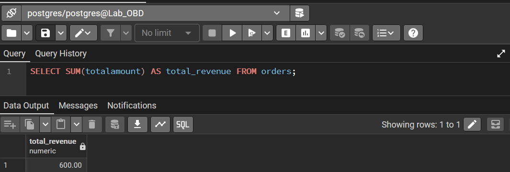
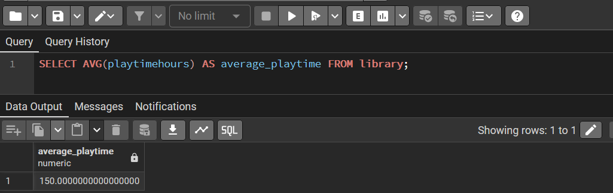
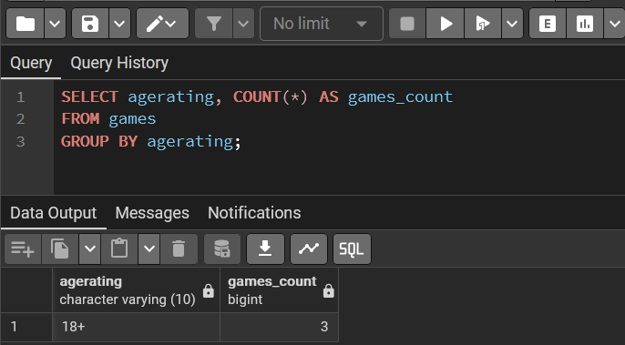
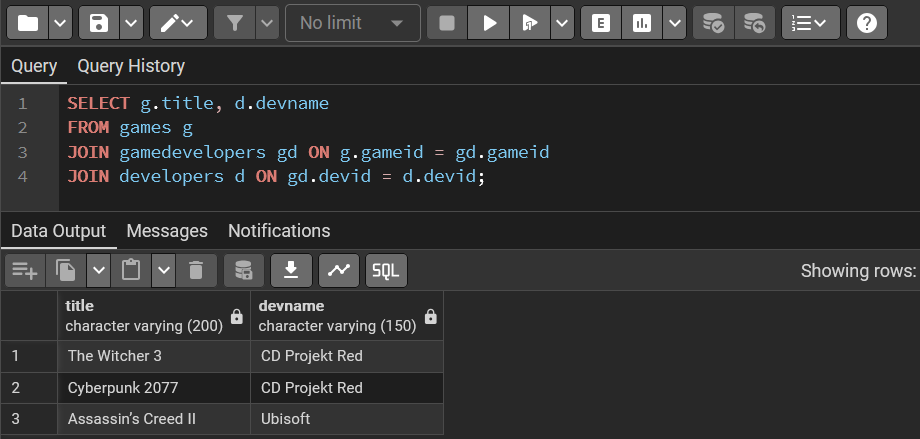
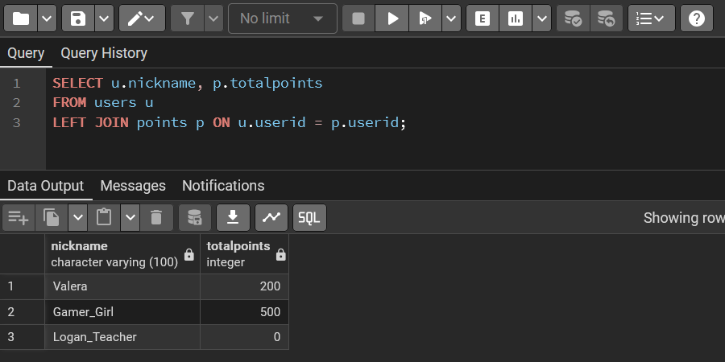
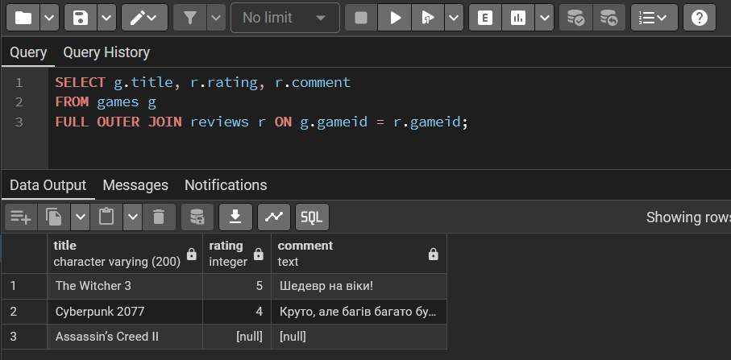
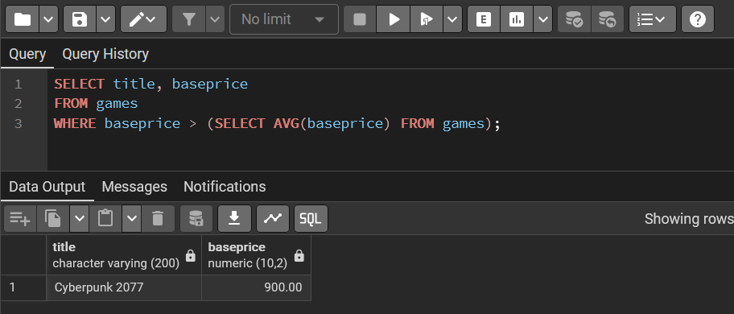
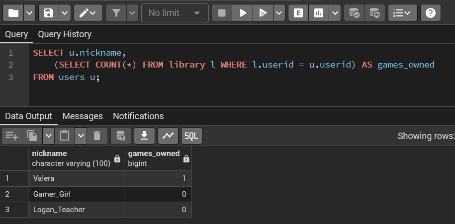

# Маніпулювання даними SQL (OLTP) (Лр №3)


<div align="right">

## 🎓 Роботу виконали
**Группа:** ІО-45

**Студенти:**
Карпець М.А.
Унятицький А.Д.
Сизоненко А.О.

**Роботу перевірив:**
Русінов В.В.

</div>

---
<center>

*Київ, 2026*

</center>

## 📋 Огляд проєкту
**Тема** - Маніпулювання даними SQL (OLTP)\
**Мета** - вивчити основні операції маніпулювання даними (DML) у PostgreSQL та спостерігати за їхнім впливом

## 🏗️ Хід роботи


#### Роздруківка коду для створення самої діаграми:
```Sql
SELECT SUM(totalamount) AS total_revenue FROM orders;
SELECT AVG(playtimehours) AS average_playtime FROM library;

SELECT agerating, COUNT(*) AS games_count
FROM games
GROUP BY agerating;

SELECT g.title, d.devname
FROM games g
JOIN gamedevelopers gd ON g.gameid = gd.gameid
JOIN developers d ON gd.devid = d.devid;

SELECT u.nickname, p.totalpoints
FROM users u
LEFT JOIN points p ON u.userid = p.userid;

SELECT g.title, r.rating, r.comment
FROM games g
FULL OUTER JOIN reviews r ON g.gameid = r.gameid;

SELECT title, baseprice
FROM games
WHERE baseprice > (SELECT AVG(baseprice) FROM games);

SELECT u.nickname,
    (SELECT COUNT(*) FROM library l WHERE l.userid = u.userid) AS games_owned
FROM users u;
```

#### Результат роботи в PostgreSQL









## Висновок
При виконанні цієї роботи ми навчилися основним операціям маніпулювання даними в бд
