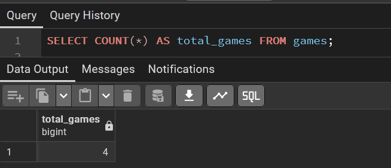
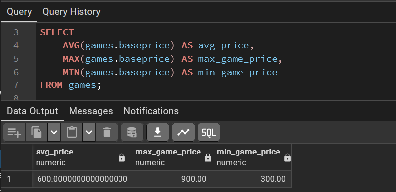
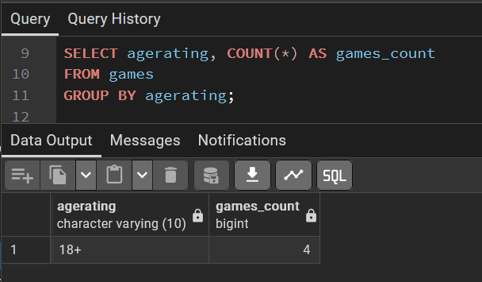
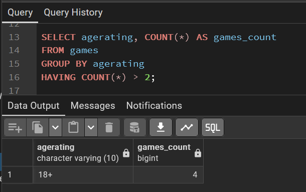
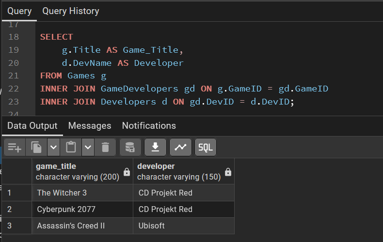
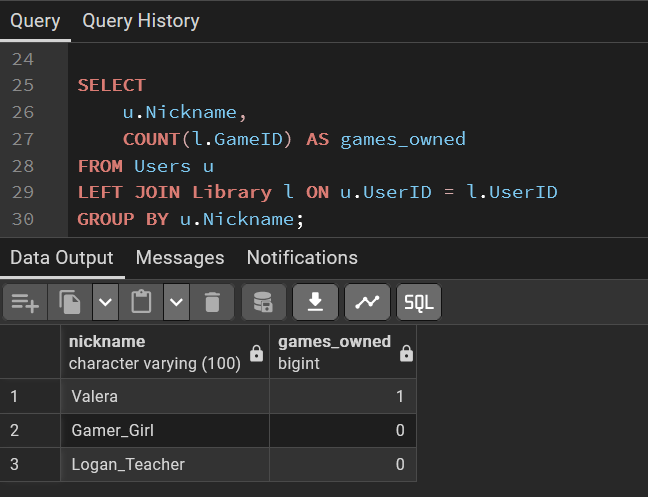
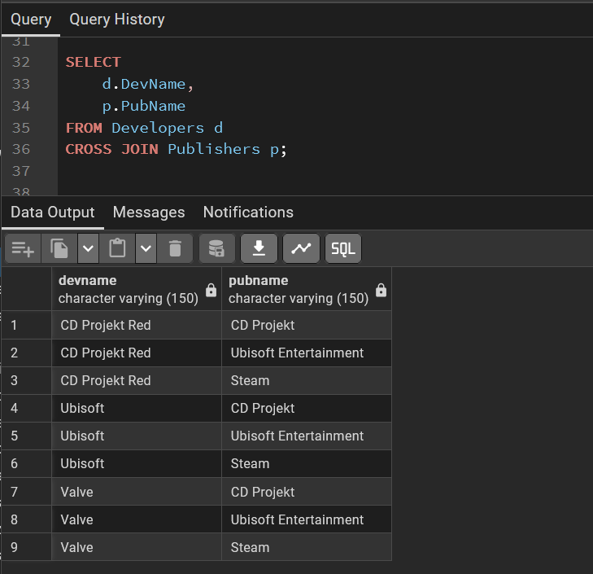
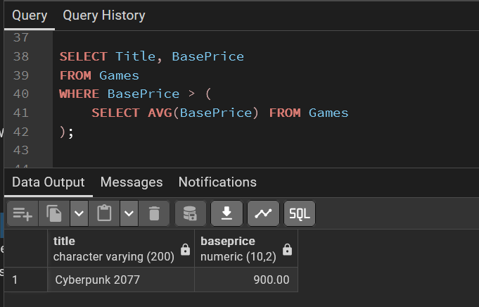
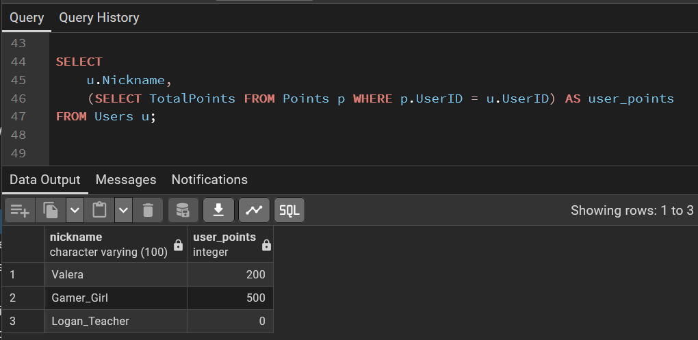
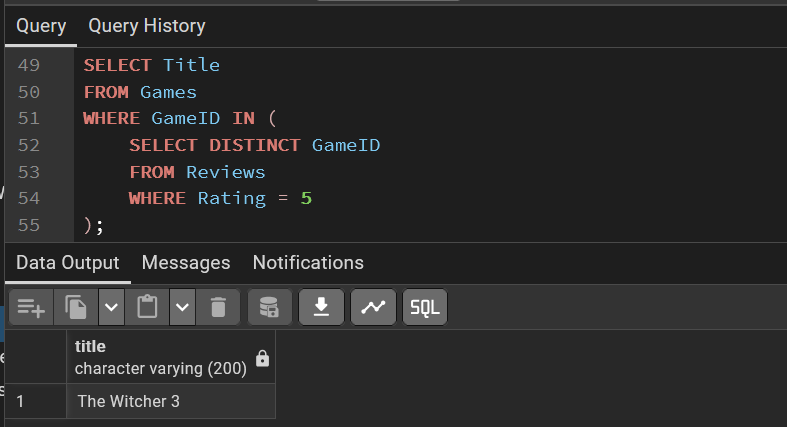

#  Аналітичні SQL-запити (OLAP) (Лр №4)


<div align="right">

## 🎓 Роботу виконали
**Группа:** ІО-45

**Студенти:**
Карпець М.А.
Унятицький А.Д.
Сизоненко А.О.

**Роботу перевірив:**
Русінов В.В.

</div>

---
<center>

*Київ, 2026*

</center>

## 📋 Огляд проєкту
**Тема** -  Аналітичні SQL-запити (OLAP).
**Мета** -  Напиcати мінімум 4 запити, що містять агрегаційні функції (SUM, AVG, COUNT, MIN, MAX, GROUP BY), мінімум 3 запити, що використовують різні типи джоінів (INNER JOIN, LEFT JOIN, RIGHT JOIN, FULL JOIN, CROSS JOIN), мінімум 3 запити з використанням підзапитів (вибірка з підзапитом у SELECT, WHERE, або HAVING).

## 🏗️ Частина 1: Агрегація та групування (Мінімум 4 запити)
#### Базова агрегація (COUNT)
Підрахувати загальну кількість ігор, представлених у магазині.


#### Агрегація (AVG, MAX, MIN)
Проаналізувати цінову політику магазину: знайти середню ціну гри, а також вартість найдорожчої та найдешевшої позиції.



#### Групування (GROUP BY)
Підрахувати кількість ігор для кожного вікового рейтингу (використовуємо agerating).



#### Фільтрування груп (HAVING)
Знайти вікові рейтинги, у яких представлено більше ніж 2 ігри.



## 🏗️ Частина 2: Об'єднання таблиць (JOINs) (Мінімум 3 запити)
#### INNER JOIN (Багатотаблична вибірка)
Вивести список: Назва гри та ім'я її розробника (через таблицю-місток GameDevelopers).



#### LEFT JOIN
Вивести всіх користувачів та кількість ігор у їхній бібліотеці. Використовуємо LEFT JOIN, щоб побачити навіть тих, у кого бібліотека ще порожня (буде 0).



#### CROSS JOIN
Створити комбінацію всіх розробників та всіх видавців (корисно для аналізу можливих партнерств).



## 🏗️ Частина 3: Підзапити (SUBQUERIES) (Мінімум 3 запити)
#### Підзапит у WHERE
Знайти ігри, ціна яких вища за середню ціну всіх ігор у магазині.



#### Підзапит у SELECT
Вивести нікнейм користувача та кількість його очок (Points), дістаючи їх безпосередньо з таблиці Points підзапитом.



#### Підзапит з IN
Отримати назви ігор, на які були написані відгуки з рейтингом 5.


<details>
    <summary>SQL скрипти</summary>

```SQL
SELECT COUNT(*) AS total_games FROM games;

SELECT
    AVG(games.baseprice) AS avg_price,
    MAX(games.baseprice) AS max_game_price,
    MIN(games.baseprice) AS min_game_price
FROM games;

SELECT agerating, COUNT(*) AS games_count
FROM games
GROUP BY agerating;

SELECT agerating, COUNT(*) AS games_count
FROM games
GROUP BY agerating
HAVING COUNT(*) > 2;

SELECT
    g.Title AS Game_Title,
    d.DevName AS Developer
FROM Games g
INNER JOIN GameDevelopers gd ON g.GameID = gd.GameID
INNER JOIN Developers d ON gd.DevID = d.DevID;

SELECT
    u.Nickname,
    COUNT(l.GameID) AS games_owned
FROM Users u
LEFT JOIN Library l ON u.UserID = l.UserID
GROUP BY u.Nickname;

SELECT
    d.DevName,
    p.PubName
FROM Developers d
CROSS JOIN Publishers p;

SELECT Title, BasePrice
FROM Games
WHERE BasePrice > (
    SELECT AVG(BasePrice) FROM Games
);

SELECT
    u.Nickname,
    (SELECT TotalPoints FROM Points p WHERE p.UserID = u.UserID) AS user_points
FROM Users u;

SELECT Title
FROM Games
WHERE GameID IN (
    SELECT DISTINCT GameID
    FROM Reviews
    WHERE Rating = 5
);

```

</details>

## Висновок
У ході виконання лабораторної роботи було опановано методи аналітичної обробки даних (OLAP) у середовищі PostgreSQL. На базі розробленої схеми «Магазин відеоігор» (аналог Steam) було реалізовано три типи складних запитів.
