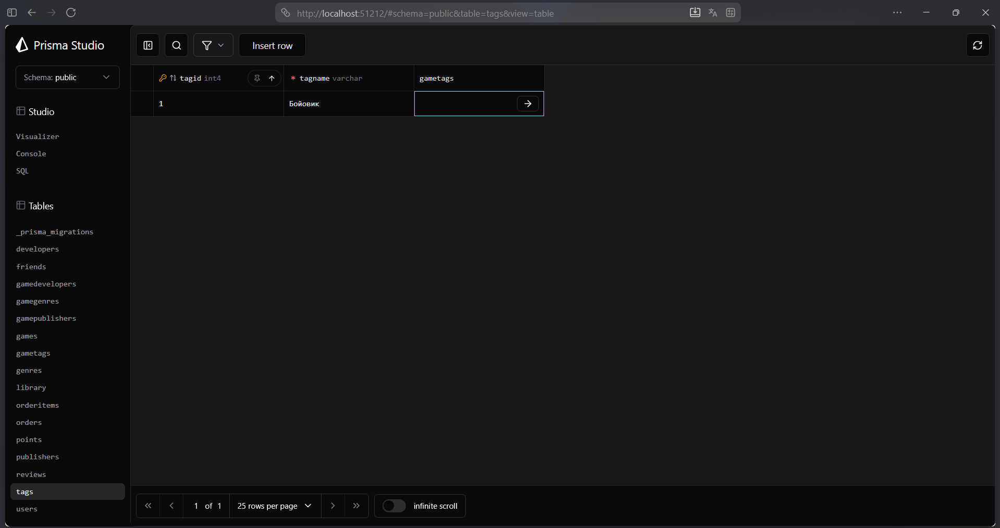
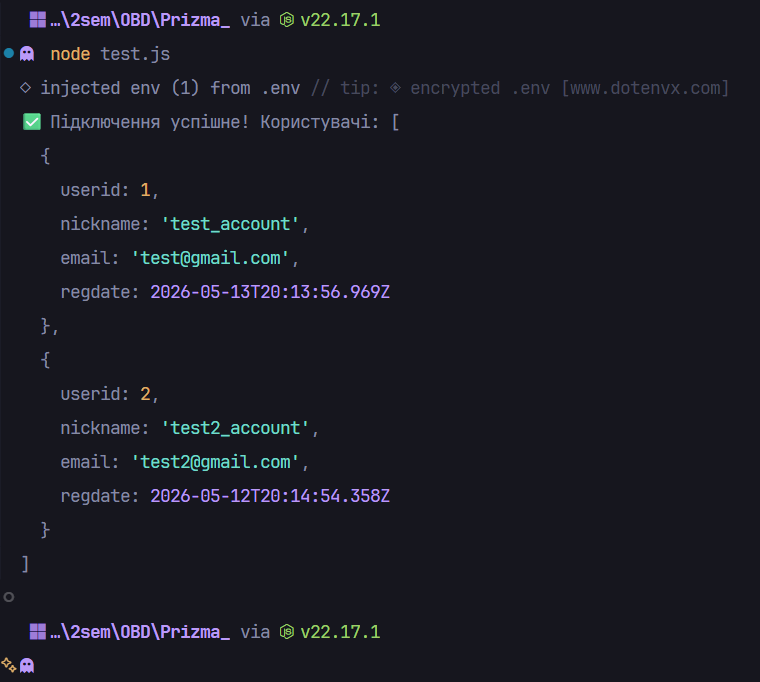

#  Міграції (Лр №6)


<div align="right">

## 🎓 Роботу виконали
**Группа:** ІО-45

**Студенти:**
Карпець М.А.
Унятицький А.Д.
Сизоненко А.О.

**Роботу перевірив:**
Русінов В.В.

</div>

---
<center>

*Київ, 2026*

</center>

## 📋 Огляд проєкту
**Тема** -  Міграції

## 1 Додавання нової моделі Tags
```Sql
model tags {
  tagid    Int        @id @default(autoincrement())
  tagname  String     @unique @db.VarChar(50)
  gametags gametags[]
}

model gametags {
  gameid Int
  tagid  Int
  games  games @relation(fields: [gameid], references: [gameid], onDelete: Cascade, onUpdate: NoAction)
  tags   tags  @relation(fields: [tagid], references: [tagid], onDelete: Cascade, onUpdate: NoAction)

  @@id([gameid, tagid])
}
```

---

## 2 Змінена таблиця Games
```SQL
model games {
  gameid         Int              @id @default(autoincrement())
  title          String           @db.VarChar(200)
  description    String?
  releasedate    DateTime?        @db.Date
  agerating      String?          @db.VarChar(10)
  baseprice      Decimal?         @default(0.0) @db.Decimal(10, 2)
  isEarlyAccess  Boolean          @default(false)
  gametags       gametags[]
  gamedevelopers gamedevelopers[]
  gamegenres     gamegenres[]
  gamepublishers gamepublishers[]
  library        library[]
  orderitems     orderitems[]
  reviews        reviews[]
}
```

---

## 3 Видалення стовпця phone з users
```SQL
model users {
  userid                         Int          @id @default(autoincrement())
  nickname                       String       @db.VarChar(100)
  email                          String       @unique @db.VarChar(150)

  regdate                        DateTime?    @default(now()) @db.Timestamp(6)
  developers                     developers[]
  friends_friends_user1idTousers friends[]    @relation("friends_user1idTousers")
  friends_friends_user2idTousers friends[]    @relation("friends_user2idTousers")
  library                        library[]
  orders                         orders[]
  points                         points?
  publishers                     publishers[]
  reviews                        reviews[]
}
```

---

## 4 Управління міграціями
Зміни були синхронізовані з базою даних PostgreSQL за допомогою Prisma Migrate.

Виконані команди:
```bash
    npx prisma migrate dev --name init_lab6 — створення та застосування SQL-міграції.
    npx prisma generate — оновлення клієнта Prisma для підтримки нових типів у коді.
```

Всі файли міграцій збережені у папці prisma/migrations.

---

## 5 Перевірка та верифікація (Prisma Studio)
Для підтвердження успішного застосування змін використано інструмент Prisma Studio.
**Результати перевірки:**
    Таблиця Tag: Повністю функціональна та готова до CRUD-операцій.
    Поле phone: успішно видалено
    Цілісність: усі зв'язки працюють коректно



---

## 5 Тестування
```js
require('dotenv').config();
const { PrismaClient } = require('./generated/prisma');
const { PrismaPg } = require('@prisma/adapter-pg');

const adapter = new PrismaPg({ connectionString: process.env.DATABASE_URL });
const prisma = new PrismaClient({ adapter });

async function main() {
  const users = await prisma.users.findMany({ take: 3 });
  console.log('✅ Підключення успішне! Користувачі:', users);
}

main()
  .catch(console.error)
  .finally(() => prisma.$disconnect());

```



## Висновок
У ході роботи початкову ненормалізовану схему бази даних було успішно приведено до Третьої нормальної форми (3НФ). Шляхом послідовного усунення багатозначних атрибутів (1НФ), часткових (2НФ) та транзитивних залежностей (3НФ), дані були розділені на логічні незалежні сутності (`Users`, `Games`, `Orders` тощо). Оновлена структура повністю позбавлена дублювання інформації та аномалій оновлення, що гарантує високу цілісність даних і готовність до подальшого масштабування.
